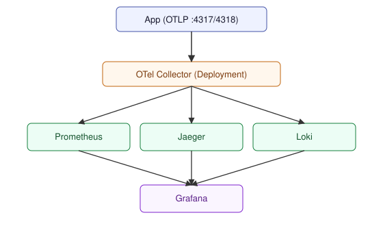

# jev — K8s Observability GitOps POC

A local Kubernetes observability POC: a 3-node **Kind** cluster running
**Cilium** as CNI (full kube-proxy replacement + Hubble), with **ArgoCD**
installed once by hand and then taking over the rest via the **app-of-apps**
pattern. After the one-time bootstrap, any commit to `argocd-apps/` in this
repo is picked up and reconciled automatically — no manual `kubectl apply`
needed again.

## Stack

| Component | Role |
|---|---|
| Kind + Cilium | 3-node cluster (1 control-plane + 2 workers), Cilium CNI with full kube-proxy replacement, Hubble UI/Relay |
| ArgoCD | GitOps reconciler — app-of-apps over `argocd-apps/` |
| Kong | Ingress + API gateway, DB-less, path-based routing + rate-limiting/tracing plugins |
| Prometheus | Metrics |
| Grafana | Dashboards (Prometheus + Loki datasources) |
| Loki | Logs (single-binary, filesystem storage) |
| Jaeger | Traces (in-memory storage) |
| OpenTelemetry Collector | OTLP ingestion, fans out to Prometheus/Jaeger/Loki |

### Data flow



## Why Cilium comes before ArgoCD

Cilium is the CNI — `kind-config.yaml` sets `disableDefaultCNI: true` and
`kubeProxyMode: none`, so nodes stay `NotReady` and no pod (including
ArgoCD's own) gets an IP until it's installed. Bootstrap order is strict:

```
1. kind create cluster   (CNI + kube-proxy disabled)
2. helm install cilium   (pod networking comes up)
3. helm install argocd   (argocd pods can now schedule)
4. kubectl apply bootstrap/root-app.yaml   (one-time; ArgoCD owns the rest)
```

## Quick start

Requires **Podman** (rootless, socket running) — see `.envrc`. Also needs
`kind`, `kubectl`, `helm`, `gh`.

```bash
source .envrc
make all      # cluster -> cilium -> argocd -> bootstrap
make urls     # print the node IP + path map once everything is up
```

Or step by step: `make cluster`, `make cilium`, `make argocd`,
`make bootstrap`. See `.claude/skills/deploy/SKILL.md` for a guided version
with pre-flight checks.

## Access the UIs

Ingress is plain `NodePort` (no `extraPortMappings`) — reached via the
node's container IP, not `localhost`. Run `make urls` for the exact URLs;
they follow this shape:

| UI | Path |
|---|---|
| Grafana | `/grafana` (admin / admin123) |
| Prometheus | `/prometheus` |
| Jaeger | `/jaeger` |
| ArgoCD | `/argocd` (admin / `kubectl get secret argocd-initial-admin-secret -n argocd -o jsonpath='{.data.password}' \| base64 -d`) |
| Kong Manager | separate NodePort `30002` (read-only, DB-less) — config/route browsing |
| Kong Admin API | separate NodePort `30001` (read-only, DB-less) |
| Hubble UI | separate NodePort `30003` — its build hardcodes a root `<base href=/>`, so it can't live behind Kong's path-prefix routing like the others |

## Repo layout

```
.
├── kind-config.yaml           # 3-node cluster, Cilium CNI, no kube-proxy
├── scripts/cilium-api-endpoint.sh
├── bootstrap/root-app.yaml    # the one manual apply — app-of-apps root
└── argocd-apps/
    ├── kong/ prometheus/ grafana/ loki/ jaeger/ opentelemetry-collector/
    │   each: app.yaml (ArgoCD Application) + chart/ (vendored Helm chart)
    │   + values/values.yaml
    └── ingress-routes/        # a separate child Application (see CLAUDE.md
        ├── app.yaml           # for why) — Kong Ingress + KongPlugin per UI
        └── routes.yaml
```

Every chart under `argocd-apps/<app>/chart/` is vendored locally (`helm
pull --version <v> --untar`) — see `.claude/skills/helm-vendor/SKILL.md` to
add or update one.

## GitOps loop

Once bootstrapped, changes flow with no manual step:

```bash
# e.g. bump a Grafana resource limit
vim argocd-apps/grafana/values/values.yaml
git commit -am "grafana: bump memory limit"
git push
# ArgoCD picks it up on its next poll — no kubectl/argocd command needed
```

## Troubleshooting

| Symptom | Likely cause |
|---|---|
| All nodes `NotReady` right after `make cluster` | Expected — Cilium isn't installed yet |
| Cilium agent `CrashLoopBackOff`, apiserver connection errors | Wrong `k8sServiceHost`/`k8sServicePort` — re-run `scripts/cilium-api-endpoint.sh` |
| Cilium `Init:CrashLoopBackOff`/`CrashLoopBackOff` (bpf mount, memlock rlimit, or bpffs permission errors) | Cluster was created under **rootless** Podman — Cilium's eBPF needs real host capabilities only rootful Podman grants. `make cluster` must run under `sudo` (see the Makefile) |
| `root` Application shows raw chart files as resources | `bootstrap/root-app.yaml`'s `directory.include` allowlist isn't matching a new file you added |
| `/grafana` 404s or loads with broken CSS | Kong's `Ingress` not synced yet, or `serve_from_sub_path`/`root_url` mismatch |
| `/jaeger` or `/argocd` broken paths | Their `base_path`/`rootpath` config must match the `Ingress`'s un-stripped prefix (`konghq.com/strip-path: "false"`; see `argocd-apps/ingress-routes/routes.yaml`'s comments) |
| Hubble UI loads blank, JS/CSS 404 | Don't route it through Kong's `/hubble` prefix — its build hardcodes `<base href=/>`, so asset requests always hit the proxy's bare root. It's exposed on its own NodePort (`30003`) instead, same as Kong Manager/Admin API |

For a guided diagnosis, use the `k8s-troubleshooter` subagent
(`.claude/agents/k8s-troubleshooter.md`).

## Production considerations

This is a **POC**, not a production setup:
- Jaeger storage is in-memory — traces are lost on restart
- Loki uses filesystem storage, not object storage
- Prometheus retention is short (6h) with no long-term storage
- No TLS, no NetworkPolicies, single replica everywhere
